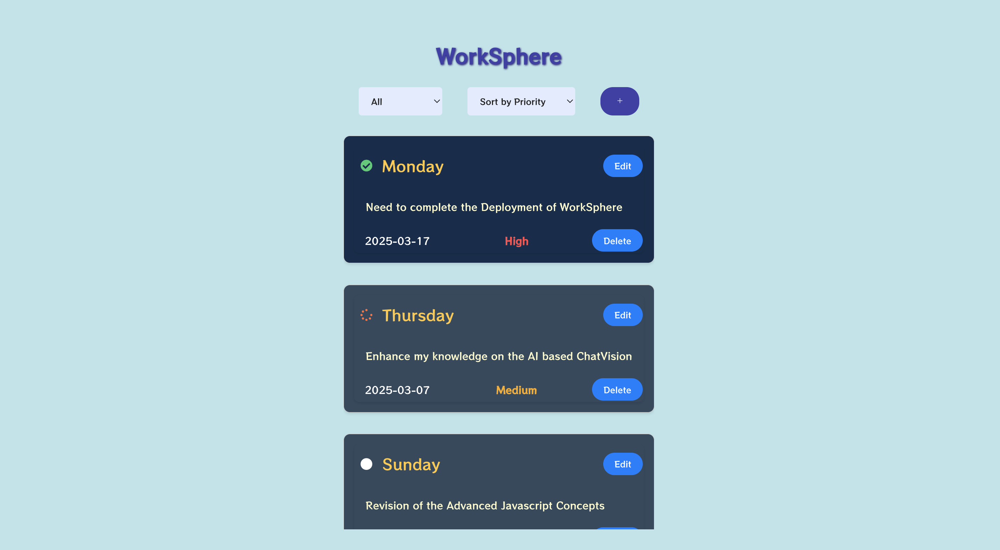

# WorkSphere

## Introduction
WorkSphere is a task management application designed to help users organize and manage their to-do lists efficiently. It provides a user-friendly interface to add, update, and delete tasks, along with features to prioritize and sort tasks based on their due dates and priority levels.

## Features
- **Add Tasks**: Easily add new tasks with a title, description, due date, and priority.
- **Update Tasks**: Edit existing tasks to update their details.
- **Delete Tasks**: Remove tasks that are no longer needed.
- **Task Status**: Change the status of tasks (Not Started, In Progress, Completed).
- **Priority Levels**: Assign priority levels (High, Medium, Low) to tasks.
- **Sorting and Filtering**: Sort tasks by priority or due date and filter them based on their status.
- **Responsive Design**: Optimized for both desktop and mobile devices.

## Use Case
WorkSphere is ideal for individuals and teams looking to manage their tasks and to-do lists effectively. It can be used for personal task management, project planning, and team collaboration. The application helps users stay organized and ensures that important tasks are prioritized and completed on time.

## Tech Stacks
- **Frontend**: React, Redux, TypeScript
- **Backend**: Dexie.js (IndexedDB wrapper)
- **Styling**: CSS, Tailwind CSS
- **Icons**: React Icons
- **State Management**: Redux Toolkit
- **Build Tool**: Create React App

## Running The Project

 - Step 1: Open the terminal, 'git clone git@github.com:addygupta21/WorkSphere.git'
 - Step 2: Install the required packages using 'npm install'
 - Step 3: Start the project on localhost using 'npm run start'

## Project Images

